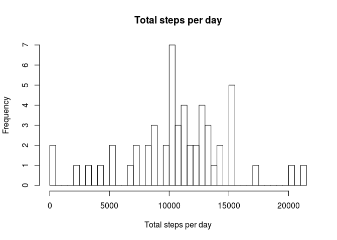
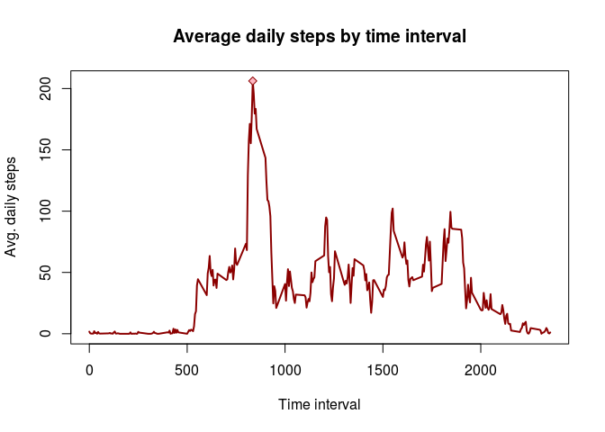
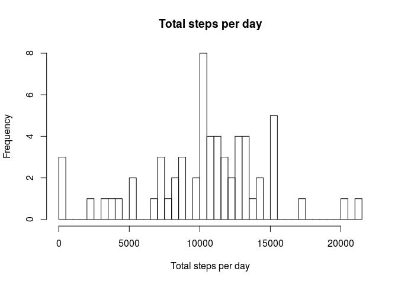
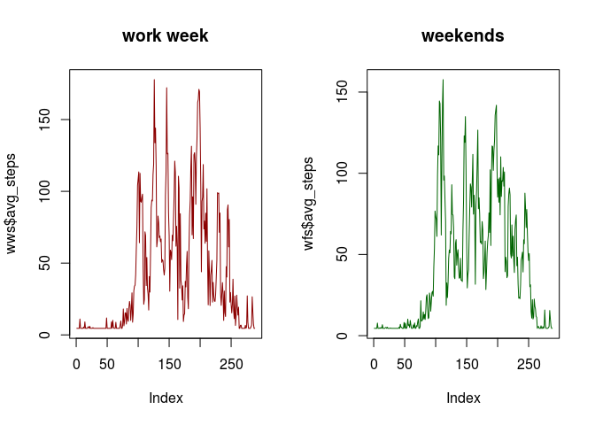

# Reproducible Research: Peer Assessment 1


## Loading and preprocessing the data

First we'll load some useful libraries, and then load data and
reformat the date column. 


```r
library(lubridate)
library(dplyr)

setwd("/home/nkrs/Documents/reproducible_research/project_1/working_dir/RepData_PeerAssessment1/")
filen <- "activity.csv"

d <- read.table(file=filen, header=TRUE, sep=",", stringsAsFactors = FALSE)
d$date <- as.Date(d$date)
```
Next, we'll sort by date, remove any missing values, and group by the date. 
Using this grouped data frame, we calculate the total number of steps for 
each day (some dates may have been omitted due to missing values). 


```r
d <- arrange(d, date)

# Keeping track of NAs
na_idx <- which( is.na(d$steps) )
na_count <- length( na_idx )

d2 <- filter(d, !is.na(steps) )
d_grouped <- group_by(d2, date)


d_final <- ungroup( summarise(d_grouped, 
                              total_steps=sum(steps,na.rm=TRUE)
                             )
                  )
```

## What is mean total number of steps taken per day?


```r
hist( d_final$total_steps, breaks=length( unique(d_final$total_steps)),
      main="Total steps per day", 
      xlab="Total steps per day"
    )
```



```r
# Calculate and report mean, median

mean_1 <- mean(d_final$total_steps)
median_1 <- median(d_final$total_steps)
```

## What is the average daily activity pattern?

We'll use the ungrouped intermediate data frame, _d2_ (see above).


```r
d2 <- arrange(d2, interval)
total_steps_pre_grouping <- sum( d2$steps )
d2_by_interval <- group_by( d2, interval)
dd <- d2_by_interval %>% summarize( avg_steps=mean(steps) )
#dd$avg_steps <- dd$avg_steps / total_steps_pre_grouping 

ii <- which( dd$avg_steps == max(dd$avg_steps) )
plot( x=dd$interval, 
      y=dd$avg_steps, 
      type="l", lwd=2, 
      col="dark red",
      main="Average daily steps by time interval", 
      xlab="Time interval", 
      ylab="Avg. daily steps"
    )

points( x=dd$interval[ii] , y=max(dd$avg_steps), 
        bg="light pink" ,
        pch=23, col="dark red" 
      )
```



```r
# The interval having maximum avg. daily steps
dd$interval[ii]
```

```
## [1] 835
```

```r
# Max value
dd$avg_steps[ii]
```

```
## [1] 206.1698
```


## Imputing missing values

In the data processing step above, we calculated _na_idx_ and _na_count_.


```r
avg_daily_steps_w_na <- group_by(d, date) %>% summarize( avg_steps=mean(steps, na.rm=FALSE) )
missing_days <- which( is.na(avg_daily_steps_w_na$avg_steps) )

avg_daily_steps_w_na$avg_steps[1] <- avg_daily_steps_w_na$avg_steps[2]

for( i in missing_days)
{
  if(i==1)
    next
  else{
    
    k<-1
    if( is.na( avg_daily_steps_w_na[i+1, "avg_steps" ] ) )
    {
      k <- 2
    }      
    avg_daily_steps_w_na$avg_steps[i] <- ( avg_daily_steps_w_na$avg_steps[i+k] +                                                          avg_daily_steps_w_na$avg_steps[i-1] ) / 2
  }
}  

avg_daily_steps_w_na[61,"avg_steps" ] <- avg_daily_steps_w_na[60,"avg_steps" ]

# Now use these imputed values to fill in every originally 
# missing data point

imputed_d <- d
for( i in na_idx )  # 'na_idx' holds indices of missing vals
{
  di_date <- imputed_d[i,"date"]
  imputed_d[i,"steps"] <- avg_daily_steps_w_na[ avg_daily_steps_w_na$date == di_date ,"avg_steps" ] 

}  

ddd <- summarise( group_by(imputed_d, date) , total_steps=sum(steps, na.rm=FALSE) )

#imputed_d_total <- summarise( group_by(imputed_d,date), total_steps=sum(steps))
hist( ddd$total_steps, breaks=length( unique(ddd$total_steps)),
      main="Total steps per day", 
      xlab="Total steps per day"
    )
```



```r
# Calculate and report mean, median

mean_2 <- mean(ddd$total_steps)
median_2 <- median(ddd$total_steps)

print( mean_2 - mean_1 )
```

```
## [1] -355.2256
```

```r
print( median_2 - median_1 )
```

```
## [1] -194
```

**NOTE: Imputing data has decreased the mean and mean values.**

## Are there differences in activity patterns between weekdays and weekends?


```r
weekend_days <- which( weekdays(imputed_d$date) == "Sunday" | weekdays(imputed_d$date) == "Saturday" )
work_week <- which( weekdays(imputed_d$date) == "Sunday" & weekdays(imputed_d$date) != "Saturday" )

work_week_frame <- imputed_d[ work_week, ]
wws <- summarise( group_by( work_week_frame, interval) , avg_steps=mean(steps) )

weekend_frame <- imputed_d[ weekend_days, ]
wfs <- summarise( group_by( weekend_frame, interval) , avg_steps=mean(steps) )


par(mfrow=c(1,2))
plot(wws$avg_steps, type="l", col="dark red", main="work week")
plot(wfs$avg_steps, type="l", col="dark green", main="weekends")
```



```r
# WEEKDAYS
mean(wws$avg_steps)
```

```
## [1] 41.86155
```

```r
median(wws$avg_steps)
```

```
## [1] 25.43446
```

```r
# WEEKEND
mean(wfs$avg_steps)
```

```
## [1] 42.20003
```

```r
median(wfs$avg_steps)
```

```
## [1] 32.53771
```
